

# a11g-final-submission

**Team Number:** 11

**Team Name:** It Worked Yesterday

| Team Member Name | Email Address       | GitHub Handle       |
|------------------|---------------------|---------------------|
| Weiye Zhai       |zhaiwy@seas.upenn.edu| master869           |
| Shankai Chen     |skchen@seas.upenn.edu| yhcsk               |

**GitHub Repository URL:** [https://github.com/ese5160/a11g-final-submission-s26-s26-t11-it-worked-yesterday.git](https://github.com/ese5160/a11g-final-submission-s26-s26-t11-it-worked-yesterday.git)

## 1. Video Presentation

## 2. Project Summary

### 2.1 Device Description

Nova Pet is a voice-interactive desktop robotic dog designed to combine embedded control, audio interaction, and IoT connectivity in a small pet-like device. Our project was inspired by the idea of creating a companion-style robot that can respond to voice commands, show facial expressions, move with servo motors, and be controlled remotely through a web dashboard.

### 2.2 Device Functionality

Our system uses the SiWG917Y MCU as the main controller. The device can capture PCM audio from the microphone and send it through Wi-Fi to a cloud virtual machine for speech recognition. After the VM recognizes the command, it sends the result back to the MCU through MQTT, and the robotic dog performs the corresponding action.

The robot includes multiple servo motors for movement, an OLED screen for facial expressions, and a speaker for PCM audio playback. It can perform basic actions such as moving forward, moving backward, turning left or right, sitting, standing, dancing, singing, and recording. The Node-RED web dashboard can also send control commands to the device and display status information such as Wi-Fi connection and current posture.

In addition, our project supports OTA firmware updates. After the device connects to Wi-Fi, the user can trigger an update from the web page, and the MCU can download and switch to the updated firmware version.

### 2.3 Challenges

One major challenge was integrating many different modules into one embedded system. The microphone, speaker, servos, OLED display, Wi-Fi, MQTT communication, and OTA update all required separate drivers and tasks, so we had to carefully manage the system structure and avoid conflicts between different functions.

Another challenge was audio processing. We needed to capture PCM audio from the microphone, upload it to the cloud, run speech recognition, and return commands to the MCU with acceptable delay. We also had to convert MP3 files into raw PCM data so that the speaker could play short sound effects correctly.

We also wanted to add a local wake-word feature. The idea was that when the user says “Hey Nova,” the robotic dog would automatically start recording, so the user would not need to manually click the record button every time. We trained a small wake-word model for this function, but deploying the model on the MCU was more difficult than expected because of memory, runtime, and integration constraints. As a result, this feature was not fully completed in the final prototype.

### 2.4 Prototype Learnings

This project helped us understand the full process of building an IoT embedded product, from PCB design and power planning to firmware development and cloud communication. We learned that system integration is often more difficult than making each individual module work separately.

We also learned the importance of debugging step by step. For each function, we first tested the basic driver, then integrated it into the whole system. This process helped us locate problems more clearly, especially when working with I²C, I²S, PWM, Wi-Fi, and MQTT.

Another important learning was task management in an RTOS-based system. Since the project includes audio input, audio output, servo movement, display update, and network communication, we needed to think carefully about task priority, memory usage, and timing.

### 2.5 Next Steps & Takeaways

In the future, we could further improve the robotic dog by deploying a local speech recognition model directly on the MCU. With a more powerful MCU and larger RAM, the device could process voice commands locally instead of relying on a cloud VM. This would make the system faster, more responsive, and closer to a true edge AI embedded system.

We could also improve the walking gait and turning motions to make the robot move more smoothly. In addition, we could polish the web dashboard, add more device status feedback, and make the OLED facial expressions more expressive.

Overall, this project gave us a strong understanding of embedded IoT system design. We learned how hardware, firmware, cloud services, and user interaction work together in a real product.

## 3. Hardware & Software Requirements

### HRS

| ID         | Description                     | Status           |
| ---------- | ------------------------------- | ---------------- |
| **HRS-01** | **1.3-Inch OLED Display Module (4-Pin)** 128×64 resolution display used to present the robotic dog’s facial expressions and system information, such as operating mode, time, network status, and alarm notifications. The display communicates with the MCU via an I²C interface and is optimized for low power consumption in continuous desktop operation.                                     | ✅               |
| **HRS-02** | **SG90 180-Degree Servo Motors (×4)** Four servo motors are used to drive the robotic dog’s four legs, enabling basic movements such as standing, sitting, walking, and turning. Each servo is controlled by PWM signals generated by the MCU and operates at 4.8–5.4V.                    |✅               |
| **HRS-03** | **Speaker** Provides audio output for sound effects, alert tones, alarm sounds, and basic music playback. The speaker is driven by the MCU through an audio interface (e.g., PWM/DAC/I2S depending on implementation).      |✅               |
| **HRS-04** | **3.7V Single-Cell Li-Ion Battery** Serves as the primary power source of the system and supports USB charging. It works together with the power management module to ensure safe and stable operation.                |✅               |
| **HRS-05** | **MCU with Integrated Wi-Fi (SiWG917Y121)** Acts as the central processing unit of the system. It is responsible for: Servo control (PWM generation), Display management (I²C communication), Audio signal control, Wi-Fi communication (MQTT / cloud interaction), Voice processing (local or cloud-assisted). The MCU must support sufficient processing capability and memory for real-time control and communication tasks.                                 |✅               |
| **HRS-06** | **Power Management Module** Manages battery charging, power distribution, and voltage regulation. The module provides: 3.3V output for MCU, OLED, and logic circuits and 5.4V output for servo motors and audio system. It must include protection mechanisms such as overcurrent, overvoltage, and undervoltage protection to ensure system safety.                                                                                                         |✅               |
| **HRS-07** | **IMU Sensor module** A 6-axis (accelerometer + gyroscope) IMU used to detect abnormal orientation and motion events (e.g., pushed, tipped over, flipped). Communicates with the MCU via I²C/SPI and supports a configurable sampling rate suitable for real-time event detection.                                                           |❌               |

### SRS

| ID         | Description                     | Status |
| ---------- | --------------------------------| ------ |
| **SRS-01** | **Motion Control Module** Responsible for controlling all physical movements of the robotic dog. The MCU generates PWM signals to drive four servo motors, enabling predefined motion sequences such as stand, sit, walk, and turn. Motion commands are triggered by voice input or remote control.                                             | ✅               |
| **SRS-02** | **Voice & Audio Interaction Module** Handles voice input and audio output of the system. Voice processing is implemented directly on the MCU (SiWG917), with two possible approaches: Local keyword detection (lightweight model), Cloud-based speech recognition via Wi-Fi. The module enables users to interact with the robotic dog using voice commands (e.g., “sit”, “stand”).                                                                                          | ✅               |
| **SRS-03** | **Display & Expression Module** Controls the OLED display to present facial expressions and system status, including: Current mode (voice/manual), Network connectivity. Display content updates dynamically based on system state.                                                                                                    | ✅               |
| **SRS-04** | **Wireless Communication & Remote Control Module** Enables communication between the robotic dog and a web/mobile interface via Wi-Fi (e.g. MQTT protocol). Users can: Control movements (forward/back/left/right), Switch modes, Configure system parameters.                                                                             | ✅               |
| **SRS-05** | **System Control & Logic Management Module** Acts as the central software controller. It: Processes inputs from voice and cloud, Manages system states and mode transitions, Dispatches commands to motion, display, and audio modules.                 | ✅               |
| **SRS-06** | **Power Management Module (Software Side)** Monitors system power status and ensures stable operation. It may include: Battery level monitoring Low-power mode handling Safe shutdown or warning mechanisms                 | ❌We did not use a voltage meter or other ADC-based sensing circuit, so the MCU could not monitor the battery voltage in real time. Low-power mode and battery warning functions were not supported.               |
| **SRS-07** | **IMU-Based Tip-Over Detection and Alarm** The system shall detect a tip-over or flip event using IMU data and trigger an alarm response by playing an alert sound or voice message through the audio module.           | ❌              |

## 4. Project Photos & Screenshots

### Nova Pet

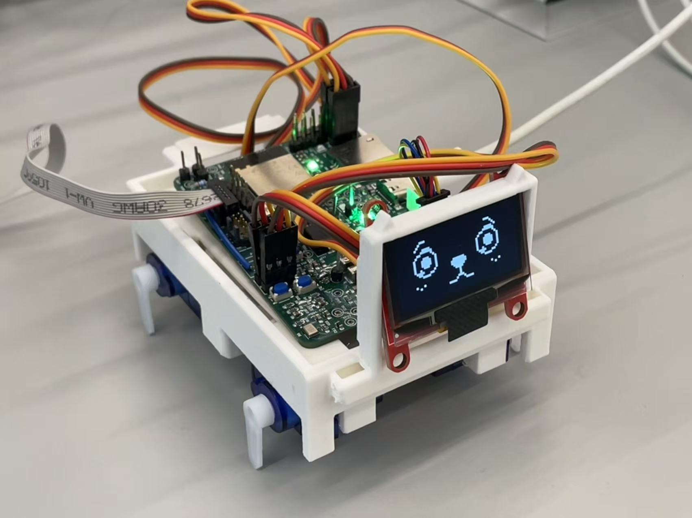

### PCBA

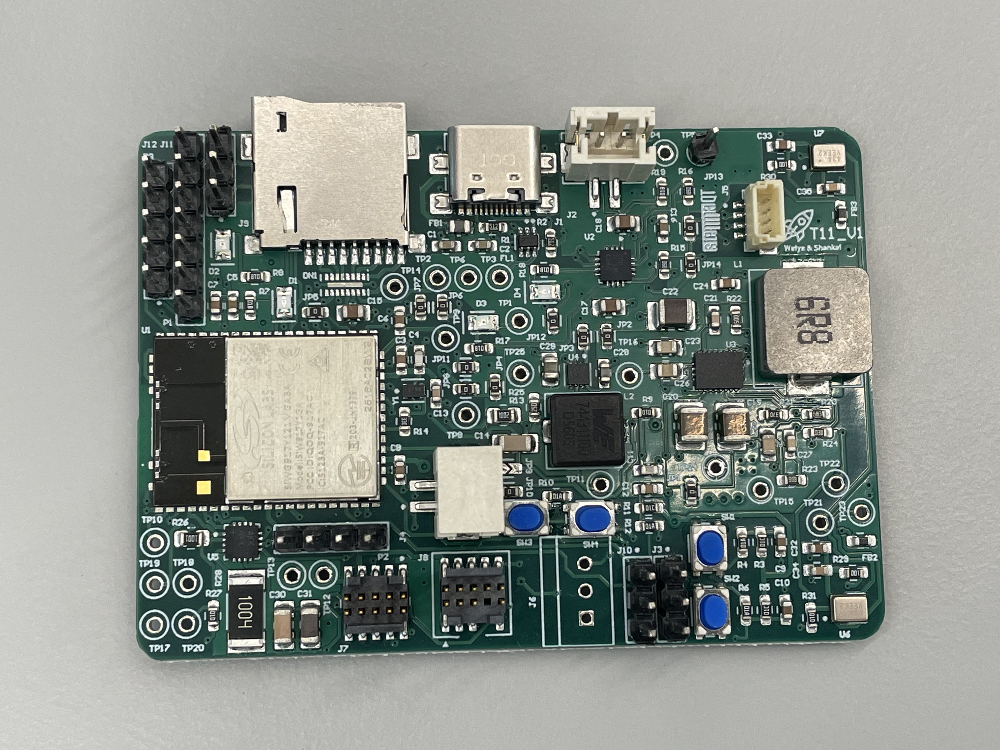

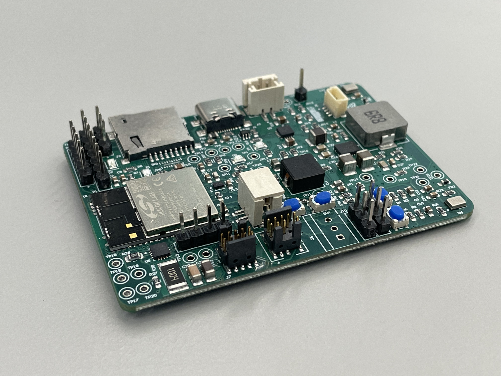

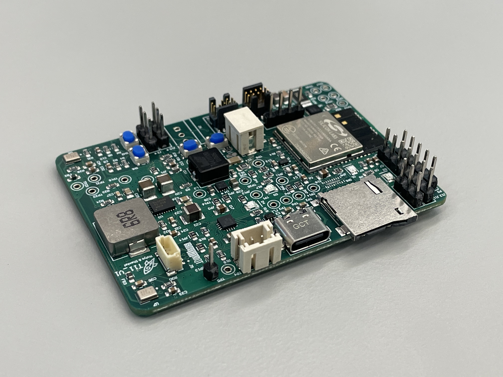

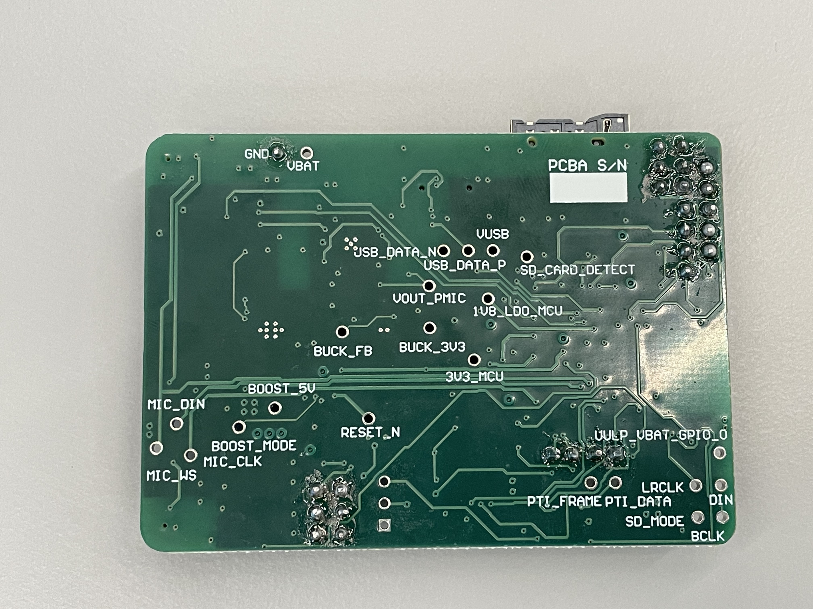

### Thermal Camera

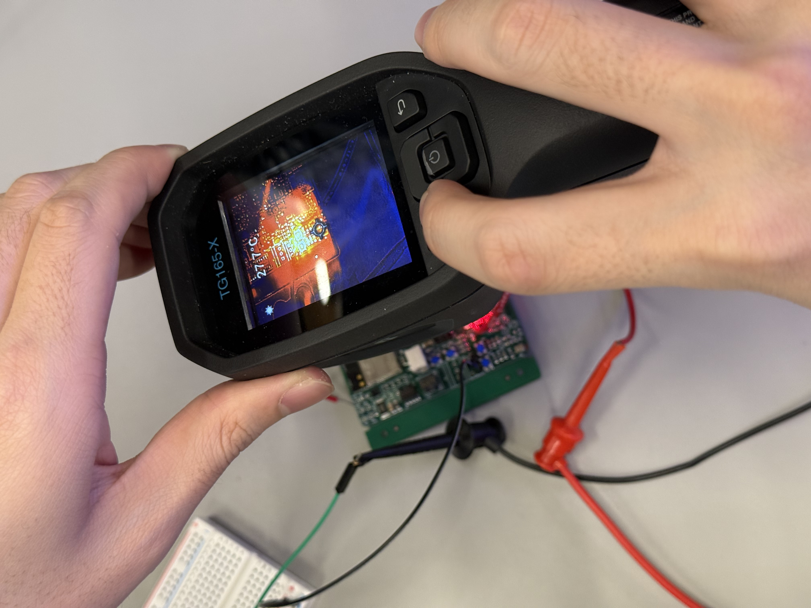

### Altium Design View

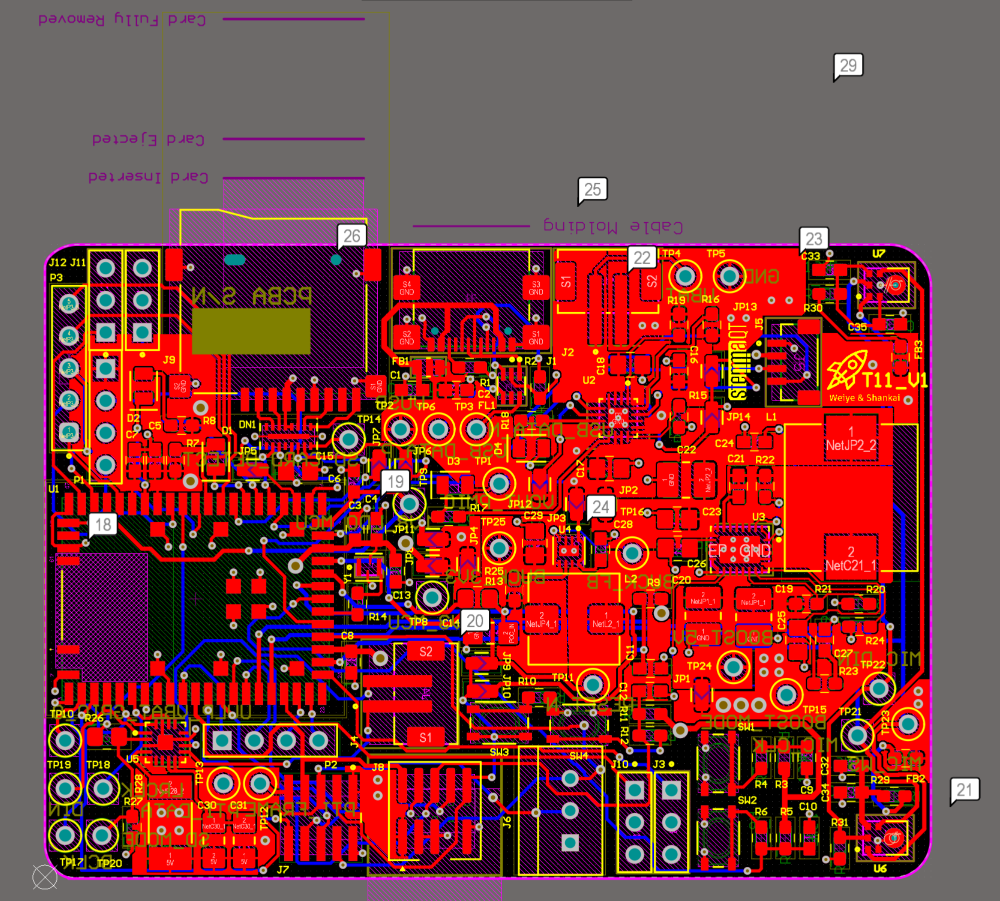

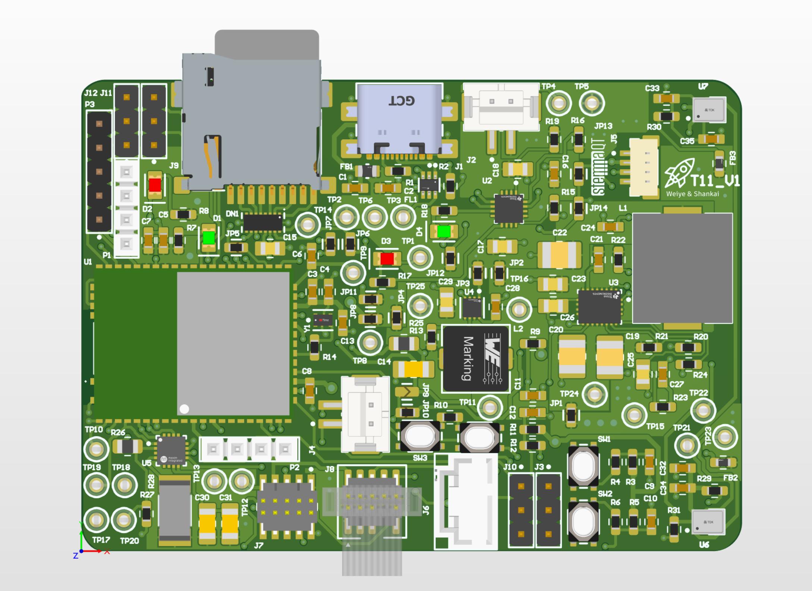

### Node-RED View

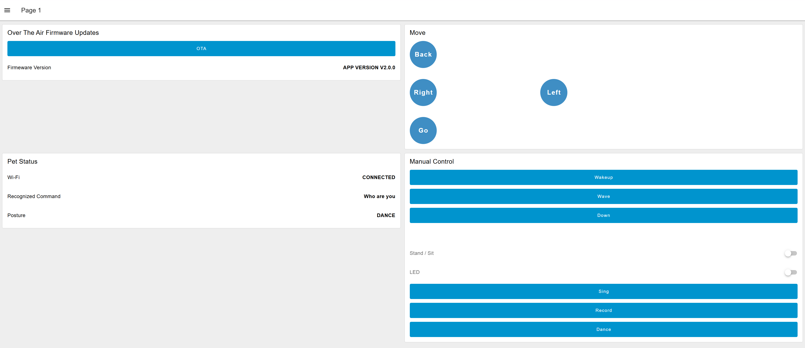

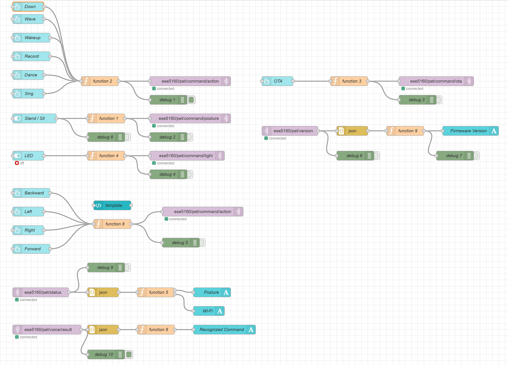

### Block Diagram

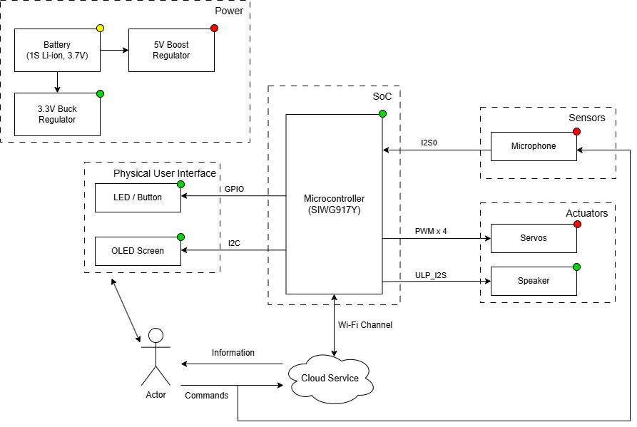

## 5. Codebase

Do *not* commit any of your source code to this repository. Rather, provide links to the other GitHub repository you've already been using with your firmware.

- A link to your final embedded C firmware codebases
- A link to your Node-RED dashboard code
- Links to any other software required for the functionality of your device